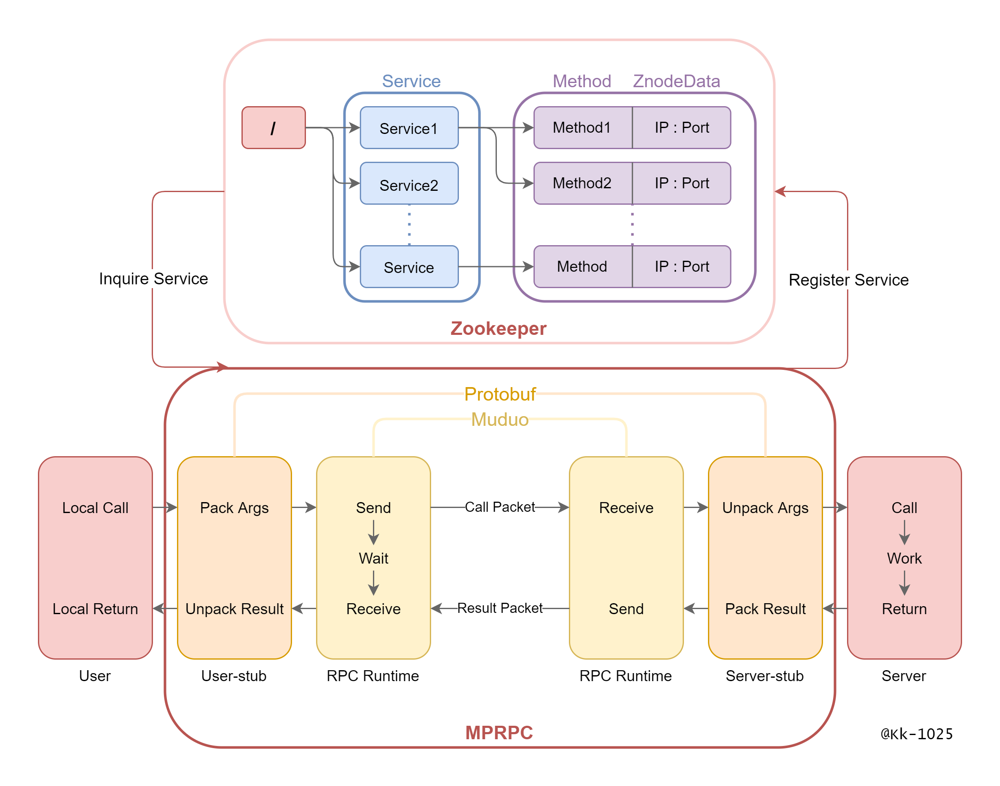

# MyMsgPackRPC

使用C++实现的RPC分布式网络通信框架，基于muduo库、protobuf、zookeeper开发，通过CMake在Linux平台上构建编译环境。


## 功能

* 可以将 任何单体架构系统的本地方法调用 重构为 基于TCP网络通信的RPC远程方法调用，实现 同一台计算机的不同进程之间 或 不同的计算机之间 的服务调用；
* 利用 基于Reactor高并发模型的muduo开源网络库，实现 网络传输层，完成RPC服务提供方和调用方之间的网络通信；
* 利用 protobuf 进行相关数据的序列化和反序列化，实现 在同构或异构系统中进行RPC方法的远程调用；
* 分离网络代码和业务代码，使得 网络传输层和RPC方法调用处理层 代码解耦，具有良好的并发性能；
* 基于 zookeeper 实现微服务的服务注册、服务发现等功能，为分布式应用提供一致性协调服务；
* 利用单例模式与阻塞队列，实现异步的日志系统，记录服务器的运行状态。


## 框架结构




## 环境依赖

* Linux
* C++11
* CMake 3.0
* muduo
* protobuf
* zookeeper


## 目录树

```
.
├── bin
├── build
├── example
│   ├── callee
│   │   ├── CMakeLists.txt
│   │   ├── friendservice.cc
│   │   └── userservice.cc
│   ├── caller
│   │   ├── callfriendservice.cc
│   │   ├── calluserservice.cc
│   │   └── CMakeLists.txt
│   ├── CMakeLists.txt
│   ├── friend.pb.cc
│   ├── friend.pb.h
│   ├── friend.proto
│   ├── test.conf
│   ├── user.pb.cc
│   ├── user.pb.h
│   └── user.proto
├── lib
├── src
│   ├── CMakeLists.txt
│   ├── include
│   │   ├── lockqueue.hpp
│   │   ├── logger.h
│   │   ├── mprpcapplication.h
│   │   ├── mprpcchannel.h
│   │   ├── mprpcconfig.h
│   │   ├── mprpccontroller.h
│   │   ├── mprpcheader.pb.h
│   │   ├── mprpcprovider.h
│   │   └── zookeeperutil.h
│   ├── logger.cc
│   ├── mprpcapplication.cc
│   ├── mprpcchannel.cc
│   ├── mprpcconfig.cc
│   ├── mprpccontroller.cc
│   ├── mprpcheader.pb.cc
│   ├── mprpcheader.proto
│   ├── mprpcprovider.cc
│   └── zookeeperutil.cc
├── test
├── autobuild.sh
├── CMakeLists.txt
└── README.md
```


## 项目运行

1、使用自动化脚本编译

```shell
chmod +x autobuild.sh
sudo ./autobuild.sh
```

2、测试，运行时通过 `-i` 选项指定配置文件

```shell
cd bin

# RPC 服务提供方
./provider -i ../example/test.conf

# RPC 服务调用方
./consumer -i ../example/test.conf 
```


## 配置文件

`./example/test.conf` 为示例配置文件，在配置文件中需要分别指定 RPC 节点 和 zookeeper服务器 的 ip、port

```shell
# rpc节点的ip地址
rpcserverip=127.0.0.1     
# rpc节点的port端口号
rpcserverport=12345
# zk的ip地址
zookeeperip=127.0.0.1
# zk的port端口号
zookeeperport=2181
```


## 致谢

[chenshuo/muduo](https://github.com/chenshuo/muduo)

[google/protobuf](https://github.com/protocolbuffers/protobuf)

[apache/zookeeper](https://github.com/apache/zookeeper)

